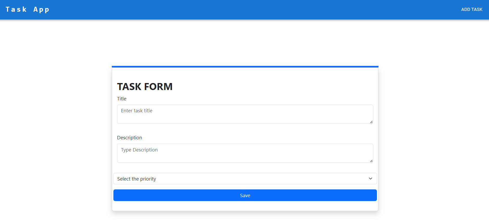
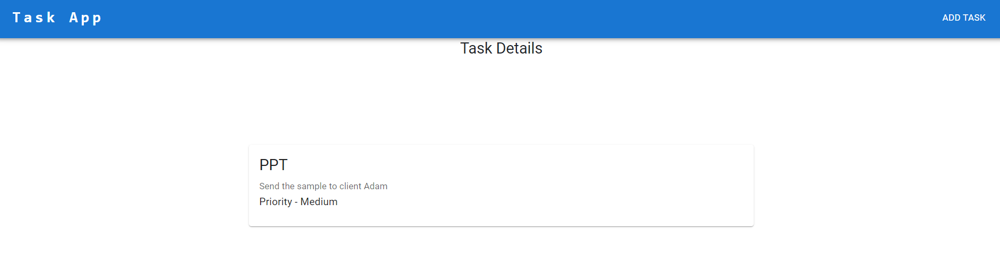

# Task Management Service

## Problem Statement

Develop a full stack application that involves creating both frontend and backend
components. The application will be a simple task management system where users can create, view,
update, and delete tasks.

Frontend:
- Implement a user interface (UI) with multiple pages:
- Home page displaying a list of tasks.
- Task details page showing detailed information about a selected task.
- Create a task page with a form to add new tasks.
- Edit task page allowing users to modify existing tasks.
- Use reusable components wherever applicable to maintain code consistency.
- Ensure responsiveness for different screen sizes. 

Backend:
- Create RESTful API endpoints to perform CRUD operations on tasks (/api/tasks):
- GET: Retrieve a list of all tasks.
- POST: Create a new task.
- GET/{id}: Retrieve details of a specific task.
- PUT/{id}: Update an existing task.
- DELETE/{id}: Delete a task.
- Implement proper validation for task creation and updates.
- Persist task data in a database (e.g., H2 Database).

### Table of contents:

- [API Contracts](#api-contracts)
- [Local Development](#local-development)
- [Testing](#testing)

## API Contracts

### POST : /api/createTask

#### Request
```shell
curl --location 'http://localhost:8080/api/createTask' \
--header 'Content-Type: application/json' \
--data '{
    "title":"Buy groceries",
    "description" : "Veggies, Veggies, Veggies, Veggies, Veggies",
    "priority":"high"
}'
```

_**Sample Response**_

Status Code :- 200 (OK)
Task added successfully

#### Request
```shell
curl --location 'http://localhost:8080/api/createTask' \
--header 'Content-Type: application/json' \
--data '{
    "title":"PPT",
    "description" : "Send the sample to client Adam",
    "priority":""
}'
```

_**Sample Response**_

Status Code : 400 - Bad request
Task has missing details

```json
{
  "httpStatus": "BAD_REQUEST",
  "data": null,
  "message": "Contact number which you have provided is not valid",
  "timestamp": 1720641742050
}
```

### GET : /api/getTasks

#### Request
```shell
curl --location 'http://localhost:8080/api/getTasks'
```

_**Sample Response**_

Status Code :- 200 (OK)
```list
[
    {
        "id": 1,
        "title": "Buy groceries",
        "description": "Veggies, Veggies, Veggies, Veggies, Veggies",
        "priority": "high"
    }
]
```

### PUT : /api/updateTask

#### Request
```shell
curl --location --request PUT 'http://localhost:8080/api/updateTask' \
--header 'Content-Type: application/json' \
--data '{
    "id":2,
    "title":"PPT",
    "description" : "Send the sample to client Adam",
    "priority":"Medium"
}'
```

_**Sample Response**_

Status Code :- 200 (OK)
Task updated successfully


### DELETE : /api/deleteTask

#### Request
```shell
curl --location 'http://localhost:8080/api/deleteTask/1'
```

_**Sample Response**_

Status Code :- 200 (OK)
Task deleted successfully


## Local Development

1. Clone the repo
2. Install all dependencies ( Make sure java is setup already )
3. If you run into any error - recheck your environment variables for JAVA_HOME.
4. Run the file [TodoApplication.java](src/main/java/com/example/todo/TodoApplication.java).
5. This will start the Tomcat server at `localhost:8080`
6. You can access the H2 SQL server at http://localhost:8080/h2-console. Refer [application.properties](src/main/resources/application.properties).
7. Install node module by running "npm install" command.
8. Run the frontend using "npm start" command.







### Testing
1. Follow the above steps for Local Development.
2. You can use Postman to test the apis
3. Or you can trigger integration tests to verify.